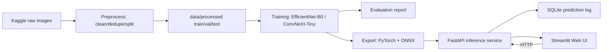

# Technical Design Document — Waste Classification System

**Author:** Argha Dey Sarkar | **Date:** 2026-07-13 | **PRD:** docs/PRD.md | **Status:** Draft

## 1. Architecture Overview



Two execution environments:
- **Local (laptop, CPU):** data preprocessing (clean/dedupe/split), dataset inspection, model export (PyTorch → ONNX), inference serving, Streamlit UI, tests.
- **Google Colab (T4 GPU):** augmentation, training, and evaluation, run interactively from `notebooks/colab_train_eval.ipynb` rather than CLI scripts — this keeps the GPU workflow in a single notebook that clones the repo, installs `requirements/requirements-train.txt`, pulls `data/processed/` split CSVs + raw images, and runs the augmentation/training/evaluation cells directly against the T4. The notebook imports reusable logic (dataset, transforms, model factory, trainer, metrics) from `src/waste_classification/`, so the notebook stays an orchestration/reporting surface rather than owning the logic — but there is no `scripts/train.py` or `scripts/evaluate.py` CLI entry point; the notebook *is* the entry point for these three stages. Checkpoints, the trained-model comparison, and the evaluation report are downloaded back to the local `models/` and `outputs/` trees afterward.

## 2. Model Selection & Rationale

| Sub-task | Chosen model | Alternatives considered | Why chosen (accuracy/latency/license/data-fit) |
|---|---|---|---|
| 12-class image classification | EfficientNet-B0 and ConvNeXt-Tiny (both trained, best selected by val accuracy + CPU latency) | ResNet50 (older, larger, no meaningful accuracy edge) | Both are torchvision-pretrained (ImageNet), Apache/BSD-licensed, small enough to fine-tune on a free-tier T4 in a reasonable time, and both export cleanly to ONNX. Training both lets the evaluation report make an evidence-based pick rather than guessing. |

Approach: load ImageNet-pretrained weights, replace the classification head with a 12-way linear layer, freeze the backbone for a warmup phase, then unfreeze and fine-tune end-to-end at a lower LR. Same recipe applied to both backbones for a fair comparison.

## 3. Data Pipeline Design

- **Dataset format:** Kaggle `garbage-classification` ships as one directory per class (ImageFolder-compatible). Raw download lands at `data/raw/garbage_classification/<class_name>/*.jpg`.
- **Ingestion & preprocessing (`src/waste_classification/data/preprocessing.py`, invoked by `scripts/preprocess.py`):**
  1. **Load & validate:** walk `data/raw/`, attempt to open every image with PIL; anything that fails to decode (`UnidentifiedImageError`, truncated file) is logged and excluded.
  2. **Duplicate detection:** hash each image (perceptual hash via `imagehash`, or MD5 as a fast exact-duplicate pass first) and drop duplicates within the same class (keep first occurrence); log count removed per class.
  3. **Split:** stratified split per class into train/val/test (default 70/15/15), writing the resulting file lists (not copies of the images) to `data/processed/splits/{train,val,test}.csv` — this keeps `data/processed/` regenerable and small enough to commit the split definition.
  4. **Materialize:** a `waste_classification.data.dataset.WasteDataset` (torch `Dataset`) reads directly from the CSV file lists + `data/raw/`, so images are never duplicated on disk.
- **Local↔Colab path portability (critical):** the split CSVs store each image path **relative to the dataset root** (e.g. `plastic/plastic_042.jpg`), never an absolute or laptop-specific path. `WasteDataset` takes a `data_root` argument (defaulting to `DATA_RAW_DIR`) and joins it with the relative path, so the exact same CSVs produced locally resolve unchanged on Colab by pointing `data_root` at the Colab/Drive location. `create_splits()` writes relative paths accordingly, and a unit test asserts no absolute paths leak into the CSVs.
- **Getting the dataset onto Colab:** the chosen mechanism is — user uploads the raw dataset once to Google Drive (a zip or the extracted `garbage_classification/` folder) and the notebook mounts Drive and unzips/points `data_root` at it. The committed split CSVs are pulled from the cloned repo (they're small). Re-downloading from Kaggle inside Colab is documented as a fallback only (requires the user's `kaggle.json`). This avoids re-uploading ~2GB every session.
- **Split strategy:** stratified random split by class label (there's no "session/source" grouping in this dataset — images are independent photos), fixed random seed stored in config so splits are reproducible.
- **Augmentation policy (train only):** `RandomResizedCrop`, `RandomHorizontalFlip`, `ColorJitter` (mild), `RandomRotation(15°)`, then normalize with ImageNet mean/std. Val/test: `Resize` + `CenterCrop` + normalize only — no stochastic augmentation, so evaluation is deterministic. Transform builders (`build_train_transforms()` / `build_eval_transforms()`) live in `src/waste_classification/data/dataset.py` so they're unit-testable locally on CPU, but they are *applied* inside the Colab notebook where training actually runs — the notebook imports and calls them rather than redefining augmentation inline.
- **Dataset versioning:** the split CSVs are the version record — committed to git since they're small text files. `data/raw/` and `data/processed/` themselves stay gitignored per convention.

## 4. Training Design

- **Framework:** PyTorch + torchvision.
- **Base weights:** `EfficientNet_B0_Weights.IMAGENET1K_V1`, `ConvNeXt_Tiny_Weights.IMAGENET1K_V1`.
- **Hyperparameters (mirrored in `.env` as `TRAIN_*`):** epochs (warmup + fine-tune split, e.g. 5 + 15), batch size 32, warmup LR 1e-3 (head only), fine-tune LR 1e-4 (full network), optimizer AdamW, LR scheduler CosineAnnealingLR, early stopping on val accuracy (patience 5).
- **Experiment tracking:** lightweight — the notebook logs metrics per epoch via the project's standard `logging` module (configured in-notebook the same way `logging_config.py` configures it locally) to a run-specific log file under `outputs/training_runs/<run_id>/`, and also keeps per-epoch metrics in a `history` dict that's saved to `outputs/training_runs/<run_id>/history.json` and plotted inline (loss/accuracy curves) at the end of the run for immediate visual feedback. No external tracker (W&B) required for this scope, keeping Colab setup friction low.
- **Entry point — `notebooks/colab_train_eval.ipynb`:** a single notebook, organized into clearly separated cells/sections, that owns augmentation, training, and evaluation end to end:
  1. **Setup:** clone repo, then **`pip install -e .`** so `import waste_classification` resolves (cloning alone does not put the package on the path), plus `pip install -r requirements/requirements-train.txt` for the training extras; mount Google Drive and point `data_root` at the uploaded raw images; pull the committed split CSVs from the clone; confirm T4 GPU is attached (`torch.cuda.is_available()`).
  2. **Data & augmentation:** import `WasteDataset`, `build_train_transforms()`, `build_eval_transforms()` from `src/waste_classification/data/`; build train/val/test `DataLoader`s.
  3. **Training:** for each backbone (`efficientnet_b0`, `convnext_tiny`) — import `build_model()` from `src/waste_classification/models/factory.py` and the `Trainer` class from `src/waste_classification/training/trainer.py`; run the warmup + fine-tune loop; checkpoint every epoch plus best-by-val-accuracy.
  4. **Evaluation:** for each trained backbone — import `compute_classification_metrics()` from `src/waste_classification/training/metrics.py`; compute per-class precision/recall/F1 + confusion matrix on the test split; render the confusion matrix and metric tables inline in the notebook.
  5. **Model comparison & selection:** compare both backbones side by side (accuracy, macro-F1, param count, approximate CPU latency estimate) in a summary table/cell; the notebook records the decision (which backbone wins) directly in its markdown so the choice is documented alongside the evidence.
  6. **Iterate if the per-class bar is unmet (explicit, not one-shot):** the PRD's hardest requirement is per-class F1 ≥ 0.75 for **all 12** classes, and this dataset is materially imbalanced (e.g. `clothes` has thousands of images while `battery`/`trash` have far fewer), so the first run may pass top-1 accuracy while a minority class falls short. The evaluation cell explicitly checks the per-class bar; if any class misses, the notebook has a documented remediation path to re-run before declaring a winner — in order: class-weighted `CrossEntropyLoss` (weights = inverse class frequency), then more fine-tune epochs / lower LR, then targeted augmentation for weak classes. This iteration is a planned part of Phase 3, not an afterthought.
  7. **Download:** zip `models/checkpoints/`, `outputs/training_runs/`, and `outputs/eval_reports/` for download back to the local machine.

  The notebook is the only place augmentation, training, and classification-metric evaluation (accuracy/F1/confusion matrix) are *executed* — there is intentionally no `scripts/train.py` CLI. All the logic the notebook calls (dataset, transforms, model factory, `Trainer`, metrics) still lives in `src/waste_classification/` and is unit/integration-tested locally on CPU with tiny fixtures, so the notebook itself stays thin — it sequences calls into tested library code rather than containing untested production logic inline. A thin `scripts/evaluate.py` does still exist, but scoped only to the one evaluation step that must run on the CPU serving target rather than the GPU — the latency benchmark (§5) — not to accuracy/F1 evaluation.
- **Checkpoint/export policy:** each checkpoint is saved as a **self-describing dict**, not a bare `state_dict` — it stores `{"backbone": ..., "num_classes": ..., "class_names": [...], "state_dict": ..., "hyperparameters": ..., "val_metrics": ...}`. This is what lets `load_checkpoint()` and `scripts/export.py` **rebuild the correct architecture from the checkpoint itself** rather than depending on `MODEL_BACKBONE` in `.env` matching the winning backbone (a fragile coupling — the winner isn't known until the notebook runs). Best checkpoint (by val accuracy) saved per run as `models/checkpoints/<backbone>-<run_id>.pt`, downloaded from Colab to local. After both backbones are compared *in the notebook*, the winner's checkpoint is copied to `models/exported/waste-classifier-v1.pt` and exported to ONNX **locally** (CPU) via `scripts/export.py` — export reads the backbone from the checkpoint, reconstructs via `build_model()`, loads weights, then exports. A metadata JSON (`models/metadata/waste-classifier-v1.json`) records backbone, dataset split version, hyperparameters, eval metrics (pulled from the notebook's `history.json`/eval report), and the training git commit.

## 5. Evaluation Design

- **Primary metric:** top-1 accuracy on test split, target ≥ 85%; secondary: macro-F1 (guards against class imbalance since dataset classes are not equally sized).
- **Evaluation slices:** per-class precision/recall/F1 + confusion matrix, computed and rendered inline in the "Evaluation" section of `notebooks/colab_train_eval.ipynb` (via `compute_classification_metrics()`) and saved to `outputs/eval_reports/<run_id>/` for download, so weak classes are visible individually, not hidden behind an aggregate number.
- **Operating threshold:** classification returns argmax class + full softmax distribution; no separate accept/reject threshold in v1 (PRD scope), but the API surfaces all 12 confidences so a caller can apply their own threshold.
- **Latency benchmark protocol:** GPU-side latency is *not* representative of the CPU serving target, so a full latency benchmark is deliberately **not** run in the Colab notebook. Instead, `scripts/evaluate.py --benchmark-latency` runs locally (CPU, the actual serving hardware) against the downloaded/exported model: N=100 single-image inferences after a warmup of 10, reporting mean/p50/p95 latency; recorded in the model metadata JSON and the performance report. This keeps the one CPU-relevant measurement out of the GPU notebook where it would be misleading.

## 6. Module Design (src/ layout)

| Module | Responsibility | Key public functions/classes |
|---|---|---|
| `data/preprocessing.py` | corrupt/duplicate detection, stratified split generation | `find_corrupted_images()`, `find_duplicate_images()`, `create_splits()` |
| `data/dataset.py` | torch Dataset + transform builders | `WasteDataset`, `build_train_transforms()`, `build_eval_transforms()` |
| `models/factory.py` | build/load backbone with replaced head | `build_model(backbone, num_classes, pretrained)`, `load_checkpoint()` |
| `training/trainer.py` | training loop, warmup/fine-tune phases, checkpointing (imported and called by the Colab notebook; no CLI wrapper) | `Trainer.fit()`, `Trainer.evaluate_epoch()` |
| `training/metrics.py` | accuracy/F1/confusion matrix computation | `compute_classification_metrics()` |
| `inference/predictor.py` | preprocessing + forward pass + postprocessing for a single image | `Predictor.predict(image) -> PredictionResult` |
| `inference/export.py` | PyTorch → ONNX export + ONNX runtime sanity check; reconstructs architecture from the checkpoint's stored `backbone` | `export_to_onnx()`, `verify_onnx_output()` |
| `api/` | FastAPI app, routes, request/response schemas, prediction logging | `create_app()`, `/predict`, `/health` |
| `api/db.py` | SQLite prediction log | `log_prediction()`, `get_recent_predictions()` |
| `utils/` | image IO helpers, hashing, visualization (confusion matrix plot) | `compute_image_hash()`, `plot_confusion_matrix()` |

## 7. Configuration

New `.env` variables:

```bash
# Data
DATA_RAW_DIR=data/raw/garbage_classification
DATA_PROCESSED_DIR=data/processed
DATA_SPLIT_SEED=42
DATA_TRAIN_RATIO=0.70
DATA_VAL_RATIO=0.15
DATA_TEST_RATIO=0.15

# Model
MODEL_BACKBONE=efficientnet_b0
MODEL_NUM_CLASSES=12
MODEL_IMG_SIZE=224
MODEL_WEIGHTS=models/exported/waste-classifier-v1.pt
MODEL_CONF_THRESHOLD=0.0

# Training
TRAIN_BATCH_SIZE=32
TRAIN_WARMUP_EPOCHS=5
TRAIN_FINETUNE_EPOCHS=15
TRAIN_WARMUP_LR=0.001
TRAIN_FINETUNE_LR=0.0001
TRAIN_EARLY_STOP_PATIENCE=5

# API / Deployment
API_HOST=0.0.0.0
API_PORT=8000
STREAMLIT_API_URL=http://localhost:8000
PREDICTION_LOG_DB=outputs/predictions.db
OUTPUT_DIR=outputs
LOG_LEVEL=INFO
```

## 8. API / Integration Design

FastAPI service (`src/waste_classification/api/`):

| Endpoint | Method | Request | Response |
|---|---|---|---|
| `/health` | GET | — | `{"status": "ok", "model_version": "waste-classifier-v1"}` |
| `/predict` | POST | multipart form, field `file` (image) | `{"predicted_class": "plastic", "confidence": 0.94, "scores": {"plastic": 0.94, "metal": 0.02, ...}, "latency_ms": 45.2}` |
| `/predictions/recent` | GET | query `?limit=20` | list of recently logged predictions (for UI history / debugging) |

- **Error handling:** invalid/non-image upload → 400 with a clear message; oversized file (>10MB, configurable) → 413; model load failure at startup → service fails fast with a critical log.
- **Auth:** none in v1 (single-user local/demo deployment) — out of scope per PRD.
- Streamlit UI is a separate process (`scripts/run_ui.py` / `streamlit run`) that calls `/predict` over HTTP using `STREAMLIT_API_URL`, keeping the UI and inference service decoupled (matches the suggested architecture: FastAPI → Web UI / API client).

## 9. Deployment Design

- **Export path:** PyTorch `.pt` (training output) → ONNX (`torch.onnx.export`, opset 17) with an `onnxruntime` sanity check comparing PyTorch vs ONNX output on a fixture batch (max abs diff < 1e-3). TensorRT/quantization explicitly out of scope (PRD §8).
- **Serving:** FastAPI + `onnxruntime` (CPU provider) for inference in the API service — ONNX is used at serving time for lower CPU latency than raw PyTorch; PyTorch weights are kept for reproducibility/retraining, not serving.
- **Decoupling API/UI development from real trained weights:** the real exported model only exists after training (Colab) + export, so to avoid blocking API and UI work on that, a helper (`scripts/make_dummy_model.py`, reusing `build_model()` + `export_to_onnx()`) produces a **randomly-initialized** model of the correct architecture exported to `.pt` + `.onnx`. The API, SQLite logging, Streamlit UI, and their integration tests are all built and exercised against this dummy artifact — outputs are meaningless but shapes/types/plumbing are real. The **smoke tests** (which assert a valid probability distribution, not correctness) run against the dummy during development and are re-run against the genuine exported model once Phase 4 lands. This means Phases 5–6 do not stall waiting on Colab.
- **Docker:** single `Dockerfile` for the FastAPI service (CPU base image, installs `requirements/requirements.txt`, copies `models/exported/` + `models/onnx/`, runs uvicorn). Streamlit UI gets a second lightweight image or a `docker/docker-compose.yml` service entry pointing `STREAMLIT_API_URL` at the API container.
- **Target hardware:** CPU-only container, no GPU assumed at serving time (matches PRD §6).

## 10. Testing Plan

- **Unit (`tests/unit/`):** corrupted-image detection, duplicate-hash detection, split-ratio correctness and stratification, transform pipeline output shapes, `compute_classification_metrics()` against known confusion matrices, config loading from `.env`.
- **Integration (`tests/integration/`):** `WasteDataset` over `tests/fixtures/` sample images end-to-end (load → transform → batch); a unit/integration check that `create_splits()` writes only **relative** paths (portability guard, §3); one-epoch training smoke run on a 2-class/4-image fixture set (CPU, seconds not minutes) to catch training-loop breakage without needing Colab; FastAPI `/predict` via `TestClient` against the **dummy exported model** (§9) with a fixture image, asserting the SQLite log row is written; ONNX export + `verify_onnx_output()` round-trip.
- **Smoke (`tests/smoke/`):** load the real exported model (PyTorch and ONNX), run one fixture image through the full `Predictor.predict()` path, assert output is a valid probability distribution over 12 classes summing to ~1.0. Run after every export and before every deployment, per convention.
- Fixture images: 2-3 small images per class subset (not all 12) under `tests/fixtures/`, small enough to commit.

## 11. Monitoring & Feedback Loop

- Every `/predict` call logs: timestamp, predicted class, confidence, full score vector, and inference latency to `outputs/predictions.db` (SQLite) — this is the "prediction logging" functional requirement.
- No automated drift detection or retraining loop in v1 (out of scope). The logged predictions table is structured so a future pass could sample low-confidence predictions for manual review/relabeling.

## 12. Risks & Mitigations

| Risk | Likelihood | Impact | Mitigation |
|---|---|---|---|
| Dataset class imbalance (e.g., far fewer "battery" images than "paper") hurts minority-class recall | High | Medium | Stratified split preserves class ratios; track macro-F1 and per-class F1, not just top-1 accuracy; consider class-weighted loss if a class underperforms |
| Colab session timeout/disconnect mid-training | Medium | Medium | Checkpoint every epoch (not just best), so a disconnected run can resume from the last checkpoint rather than restarting |
| PyTorch↔ONNX numeric drift changes predictions at serving time | Low | High | `verify_onnx_output()` integration test gates every export; smoke test re-validates the actual exported artifact before deployment |
| Corrupted/duplicate images silently degrade training data quality | Medium | Medium | Preprocessing pipeline explicitly detects and logs both, with counts reported so data quality is visible, not assumed |
| CPU inference latency exceeds 300ms budget | Low | Low | ONNX Runtime CPU provider (faster than raw PyTorch) chosen specifically for serving; latency benchmarked in evaluation and re-checked in smoke tests |
